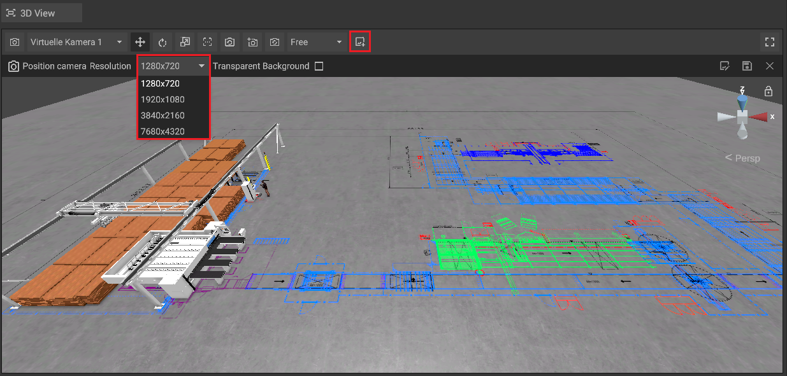
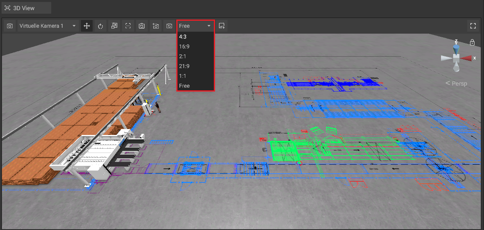
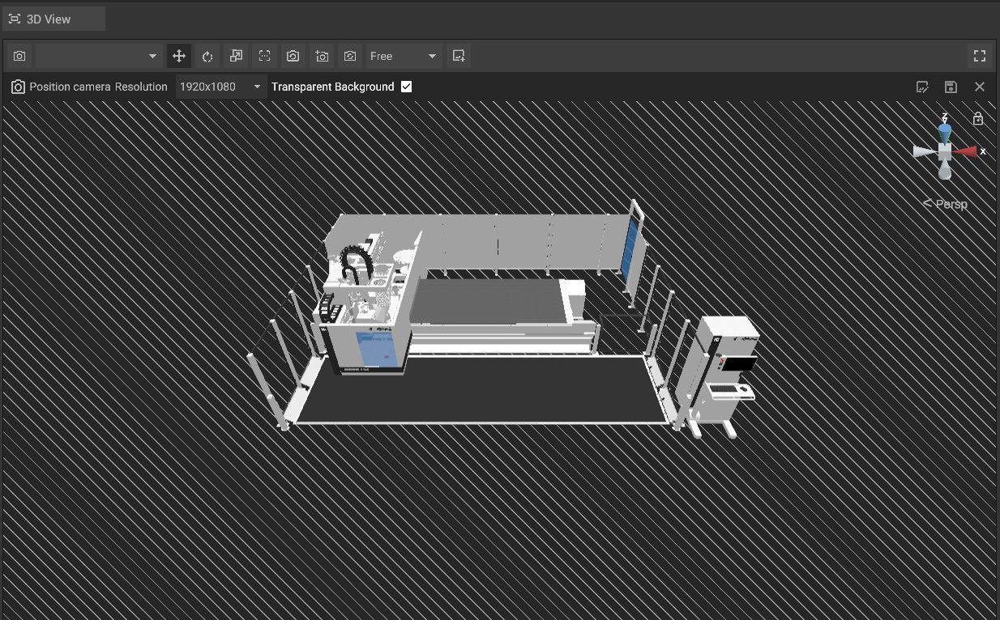
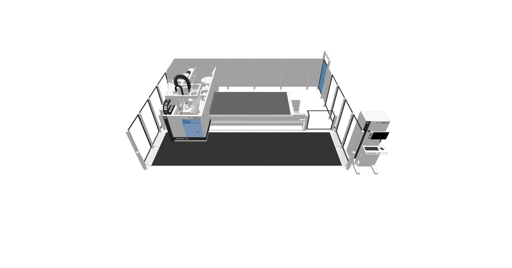
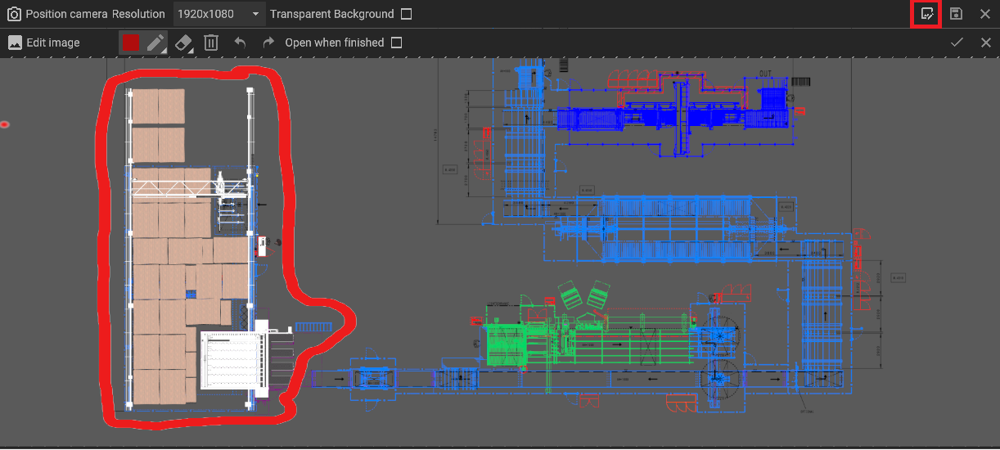

# Creating Screenshots
  
It is possible to save the current content of the 3D- or 2D-Panel as a screenshot. To do so, first click the screenshot button in either panel.
A new window will open, in which you will be prompted to pick a location for your screenshot.

  

## Changing the Screenshot Resolution
  
A new window will open that lets you specify the resolution of the screenshot. If the "Open" option was checked, the screenshot will be opened in the default image viewer after it has been created.

## Changing the Aspect Ratio of your Screenshot

You can change the aspect ratio of your screenshot by clicking on the "Aspect ratio" button, to reveal a dropdown menu.  

## Transparent Background

You have the option to create a screenshot without any background, by clicking on the "Transparent Background" option.
A screenshot with a transparent background will have a clear cut of your chosen machine or object.

## Marker- and Eraser-Tools

Before saving your sreenshot, you also have the option to use the annotation tool to highlight any given object inside the 3D- or 2D-Panel. To do so, click on the "Annotate" button highlighted below.   
To erase any unwanted markings, you can use either the Eraser- or Clear-Tools.

