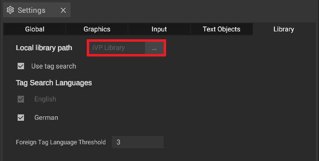

# Local Library

You can import your own files/objects from your PC into iVP by using the "Import" option, found under the "File" menu at the top of the application.  

 

When importing your file, you have the option to change its parameters, as well as the option to add it to your library, which then will show up at the bottom of the default library on the left side of the application.

### iVP Library  

Once you have added an item to your library, the folder "iVP Library" will appear at the bottom of the library panel.
Every item that you import, and chose to add to your library, can be found inside the "iVP Library" folder.  

### Editing your iVP Library

When hovering an entry in the library, a button with a folder icon will appear. Clicking it will open the respective folder or select the respective file in your file browser  

  
Your "iVP Library" folder will be created in the default iVP-Directory.  
You can click on the folder button (highlighted below) next to any object inside the folder to open the directory.  
  
The folders name can be changed at any time by editing the folder directly in the directory, which  

You can create your own iVP library folder in whichever directory you want to, by selecting the "Libraby" tab in the iVP settings, found at the top of the application.

  

### Moving Files to and from your personal Library

You can also add files to your library by placing them into the library folder as described above. 
Once your files are inside your library folder, they will show up in iVP Planning, and can be placed from your personal library.

You can freely organize your files inside your library. You can create new folders and move files between them. The library in Planning will resemble the folder structure you create on your computer.  
Everytime you add a new object to your library, a new folder with the same name as the obect will be created. (e.g. below)

The files that need to be moved are:  
*Original file  
DEFAULT file  
_NAME folder*

  
Example:  
To move the Heavy Duty Gripper object, you would need to move every corresponding file to another folder, to assure the object will work correctly.  
  
  
