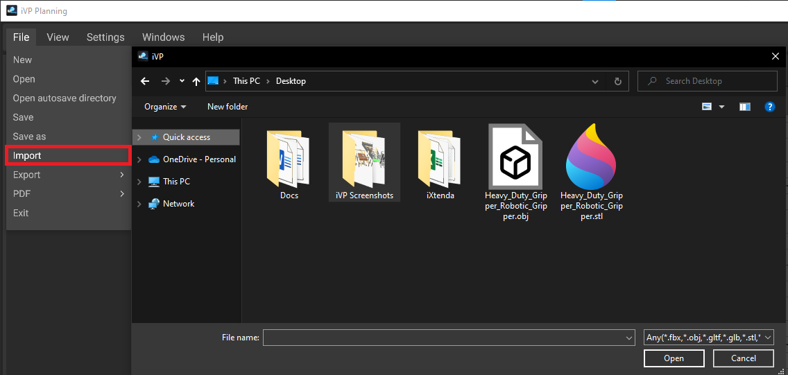
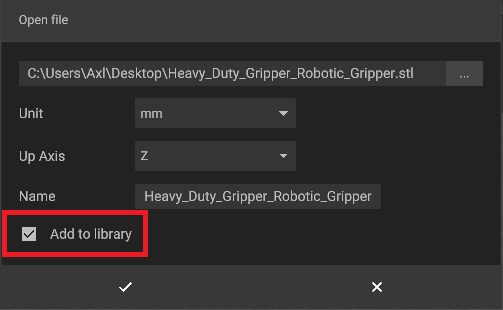
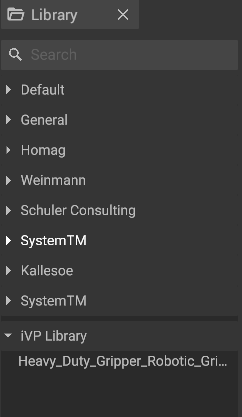

# Local Library

You can import your own files/objects from your PC into Planning by using the "Import" option, found under the "File" menu at the top of the application.  

 

When importing your file, you have the option to change its parameters, as well as the option to add it to your library, which then will show up at the bottom of the default library on the left side of the application.

### iVP Library  

The first time you import a file, a folder named "iVP Library" will be created in the **Users directory of your PC**. (e.g. C:\Users\USERNAME\iVP Library)
Every item that you import, and chose to add to your library, can be found inside the "iVP Library" folder.  

  

Additionally, you can use the **Settings tab** to locate the folder.  

### Editing your iVP Library

When hovering over an entry in the library, a button with a folder icon will appear. Clicking it will open the respective folder or select the respective file in your file browser.  

  

### Moving Files to and from your personal Library

You can also add files to your library by manually placing them inside the library folder.
Once your files are inside your library folder, they will show up in Planning and can be placed.  

You can freely organize your files inside your library. You can create new folders and move files between them. The library in Planning will resemble the folder structure you create on your computer.  

Example:  
To move the Heavy Duty Gripper object, you would need to move every corresponding file to another folder, to assure the object will work correctly.  
  
