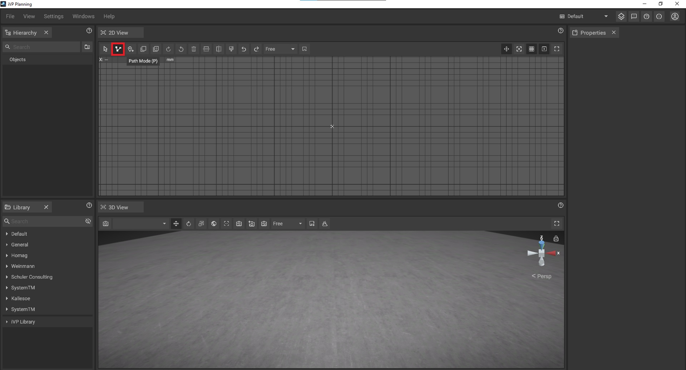
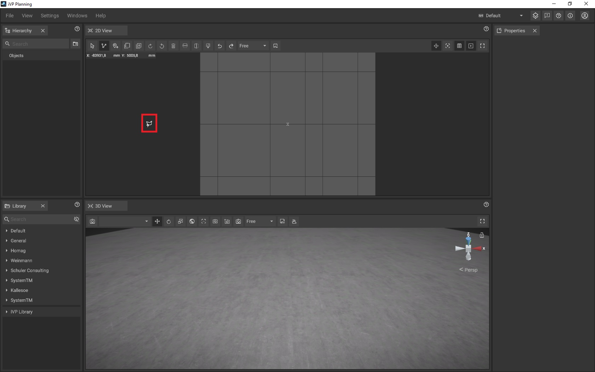
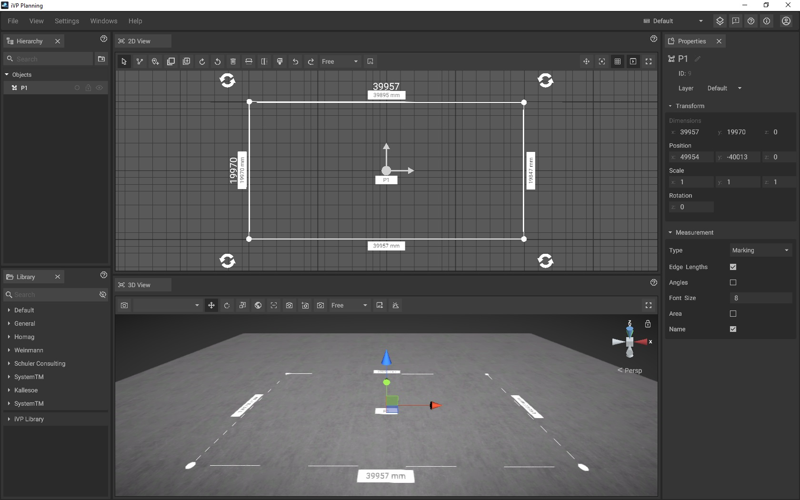
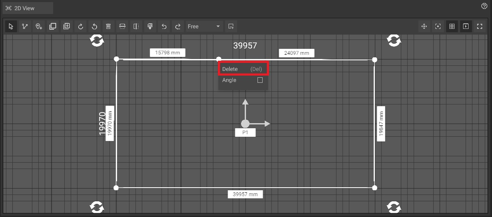
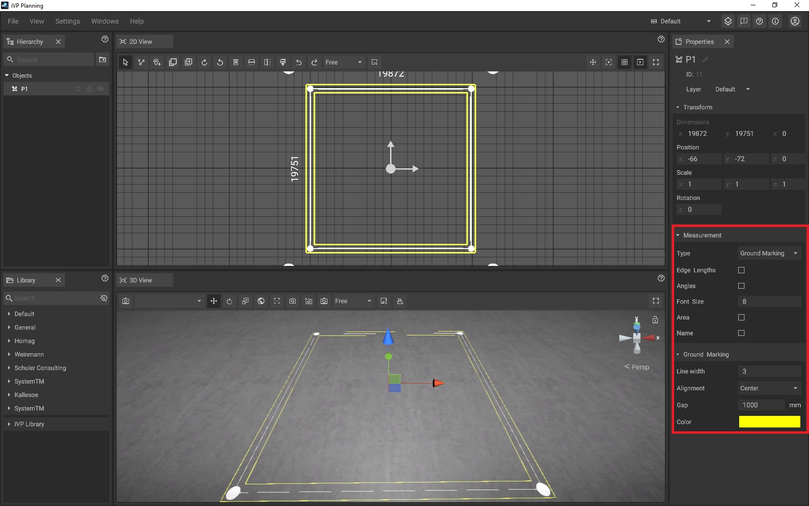
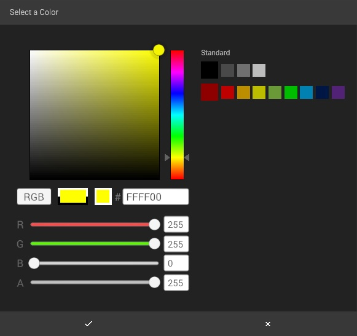

# Path Tool

The path tool is an easy yet remarkably powerful function of iVP that can be utilized for quick measurements as well as advanced highlighting. In its various forms - including the [fence tool](fence-tool.md) and the [room tool](the-room-tool.md) - it can also expedite the creation of complex [fences](fence-tool.md#creating-a-fence) and [rooms](the-room-tool.md#creating-a-room) within minutes.


How to use the path tool


## Path creation, lengths and angles

The path tool can be activated either by clicking on the path tool icon in the [2D-panel toolbar](../user-interface/the-2d-panel.md#the-toolbar-of-the-2d-panel), or by pressing its shortcut, "P", on your keyboard.

After activation, a small path icon will follow your curser, indicating that you are in the path mode.

To create a path, **left-click on a position** in the [2D-panel](../user-interface/the-2d-panel.md). A small circle will appear, marking the spot of the click and functioning as the first measurement point. When the mouse is moved after the click, a line will appear between the measurement point and the mouse pointer. To set a new measurement point, simply **left-click on another position** in the [2D-panel](../user-interface/the-2d-panel.md).

During the creation process of the path, each line and corner will automatically display its length or angle.

To complete a path, you can either press **Enter** or **double-click on the last measurement point** set. Upon completion, the path is saved as a permanent object that can be adjusted or deleted in the [hierarchy panel](../user-interface/hierarchy-panel.md)


If the path contains three or more measurement points, it will automatically be closed after creation (the first and the last measurement points will be connected automatically).


The path creation can be canceled at any time by pressing the **Escape key**. This allows for quick measurement of distances or angles without creating a permanent path.

## Path selection and editing

Existing paths can be selected by **clicking on the path name** in the [hierarchy panel](../user-interface/hierarchy-panel.md).

To add new points to a selected path, **right-click on a line** and then click on **add point**.

To delete a point, **right click on the point** and then click on **"Delete"**.

To move points, simply **drag them** with the **left mouse button**.

### Editing Path Distance and Angles

Existing paths can be further edited to adjust the individual lengths between corner points. To do so, highlight one of your corner points and edit either the "Distance to previous point" or "Distance to next point" options. It is possible to edit both options at the same time.

Additionally, you can edit the individual axis angles of a path. The blue line serves as the global Y-axis, providing a better reference point when adjusting your angles.  
The angles are measured based on the line between two points, where one of these points is the current point and the other is either the previous or the next point. The angle is formed between this line and the vertical axis (blue line)

## Measurement display options

You can toggle the display of **edge lengths**, **angle** and **area** information for each path by right-clicking on them and selecting the corresponding option in the context menu.

Alternatively it is possible to hide or show all lengths or angles by changing the entry in the measurements of the [properties panel](../user-interface/the-info-panel.md) and subsequently clicking on **edge lengths**, **angles** or **area**.

## Ground Markings

It is possible to convert your path into a ground marking, enabling you to highlight specific areas with color-coding, which will be visible in the [2D-panel](../user-interface/the-2d-panel.md) and [3D-panel](../user-interface/the-3d-panel.md). To do so, simply change the paths type to **Ground Marking** in the [properties panel](../user-interface/the-info-panel.md).

Besides the regular path options, you will also have the option to change the **line width**, the ground markings **alignment**, **gap** and its **color**.

