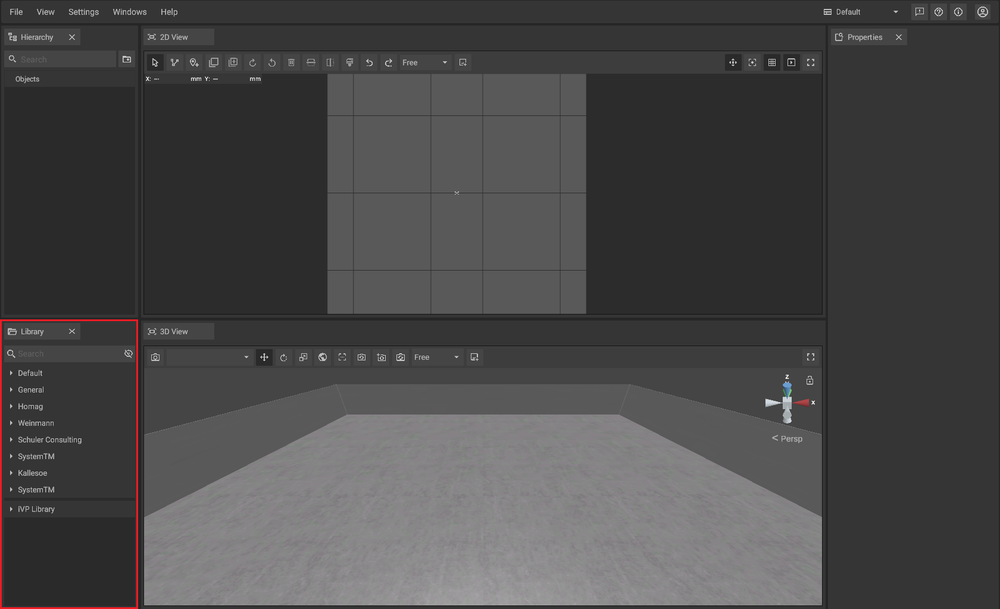
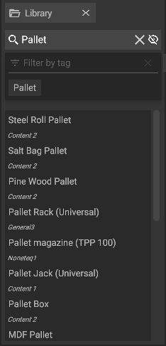

# Library Panel

The library panel is used to [add new machines and objects](../machines/first-steps-with-3d-object.md) to the [2D](the-2d-panel.md) or [3D-panel](the-3d-panel.md).

## The elements of the panel:

|                                                                                      |                                                                                                                                                                                                                         |
| ------------------------------------------------------------------------------------ | ----------------------------------------------------------------------------------------------------------------------------------------------------------------------------------------------------------------------- |
|    | The search bar makes it possible to filter the databases for specific objects which names contain the entered text (the search is not case sensitive), this includes your [Local Libray](../advanced-tools/local-library.md)                  |
|  | The databases are displayed as expandable tree structure; by clicking on the name of an object you can [add it](../machines/first-steps-with-3d-object.md) to the [2D-](the-2d-panel.md) or [3D-panel](the-3d-panel.md) | 
 | The toggle option on the right side of the search bar can be activated to see the specific sub-folder in which each object will be found. It also allows to include currently not loaded machines in your search. |  
